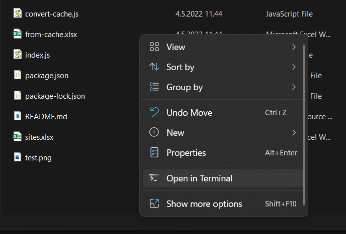

## A [Web Scraper](https://www.parsehub.com/blog/what-is-web-scraping/) for [ERA Articles](https://european-retail-academy.org)

#### Writte in JavaScript to run with [Node.JS](https://nodejs.org/en/)

#

### How to run:

- Install [Node.JS](https://nodejs.org/en/) from the link above
- Install the required dependencies with `npm install` in a terminal in the root directory of this project.
- Run the code with `node index`
- The program will the ask how many articles you would like to scrape.
- When the program is done, it will generate a `sites.xlsx` file with all the posts

#

### Known Bugs
- It's known that the program doesn't actually sort the posts by the date, but this is easy to in excel. Tutorial [HERE](https://support.microsoft.com/en-us/office/sort-by-dates-60baffa5-341e-4dc4-af58-2d72e83b4412)

#

You can open a terminal to a directory like this:

